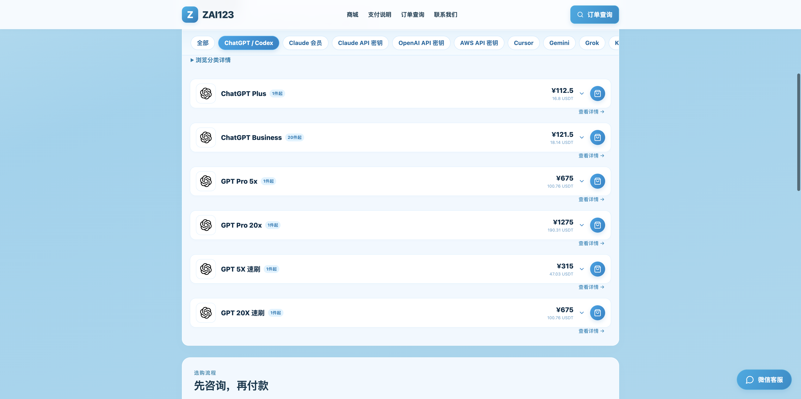

# ChatGPT 充值与代充：Plus / Pro 价格与购买指南

想用支付宝或微信购买 ChatGPT 会员？这里直接列出 **ZAI123 的套餐与实付价格**，再说明原号代充、成品账号怎么选，以及付款和交付步骤。

## ChatGPT Plus / Pro 当前价格

以下均为 **1 个月套餐、1 件价格**，支付宝／微信实付已包含 **5% 手续费**，单位为人民币。

| 套餐 | 商品价 | 支付宝／微信实付 |
| --- | ---: | ---: |
| ChatGPT Plus | ¥112.50 | **¥118.13** |
| GPT Pro 5x | ¥675.00 | **¥708.75** |
| GPT Pro 20x | ¥1,275.00 | **¥1,338.75** |

**[进入 ZAI123 首页，选择套餐](https://zai123.com/?utm_source=github&utm_medium=referral&utm_campaign=chatgpt_recharge_guide&utm_content=readme)**

上表三款均提供 **3分钟办理、30天质保**，原号代充和成品账号均适用。

价格核对：**2026 年 10 月 4 日**，下单以页面当前报价为准。另有速刷、Business 商品，见 [完整价格与选购说明](docs/chatgpt-plus-pro-guide.md)。

## 给自己的账号充值，还是买成品账号？

- **继续用自己的账号：选原号代充。** 由客服为你指定的账号办理会员。
- **需要另一个账号：选成品账号。** 按所选商品交付账号。

上表三款均支持代充和成品，1 件起购。主要用 Codex 的用户，可先看 [Codex 该选哪种服务](docs/codex-recharge-guide.md)。

## 在 ZAI123 怎么购买？

1. **选套餐。** 首页选择 ChatGPT / Codex 分类，选商品、代充或成品、数量，点击“立即购买”。
2. **看实付金额，联系客户服务。** 选择支付宝或微信，页面显示商品金额、手续费及总额；复制页面上的客服微信，添加后确认订单内容并按指引付款。
3. **收取交付并验收。** 客服人工核实收款后办理，完成后登录对应账号查看套餐及到期信息。

支付宝、微信通过客服办理；网站也提供 USDT 支付，具体操作见页面订单说明。需要看付款界面的，可查看 [Plus 购买截图](docs/chatgpt-plus-pro-guide.md#付款界面与交付验收)。

## 有效期、交付时间和售后

**ChatGPT Plus、GPT Pro 5x、GPT Pro 20x：有效期均为 1 个月，3分钟办理、30天质保。** 这三款的原号代充和成品账号均适用。

已经有会员的账号，付款前向客服说明当前套餐及到期时间，以便确认续费或升级安排。

速刷按各自商品规则交付；目前 GPT 20X 速刷页面标注 **3 天质保，账号失效补号**。速刷和 Business 不套用上述常规套餐承诺，按各自商品说明及订单约定办理。

售后通过购买时的客服处理，提供付款和沟通记录，以及已有的订单号即可。

## 首页实拍与更多指南

- [Plus / Pro 怎么选、怎么续费](docs/chatgpt-plus-pro-guide.md)
- [Codex 充值与使用指南](docs/codex-recharge-guide.md)

本指南由 **ZAI123 商家维护**，包含本店购买入口，非 OpenAI 官方文档。欢迎在 Issues 反馈文档错误；订单问题请联系网站客服，公开讨论中请勿粘贴账号或支付凭证。
