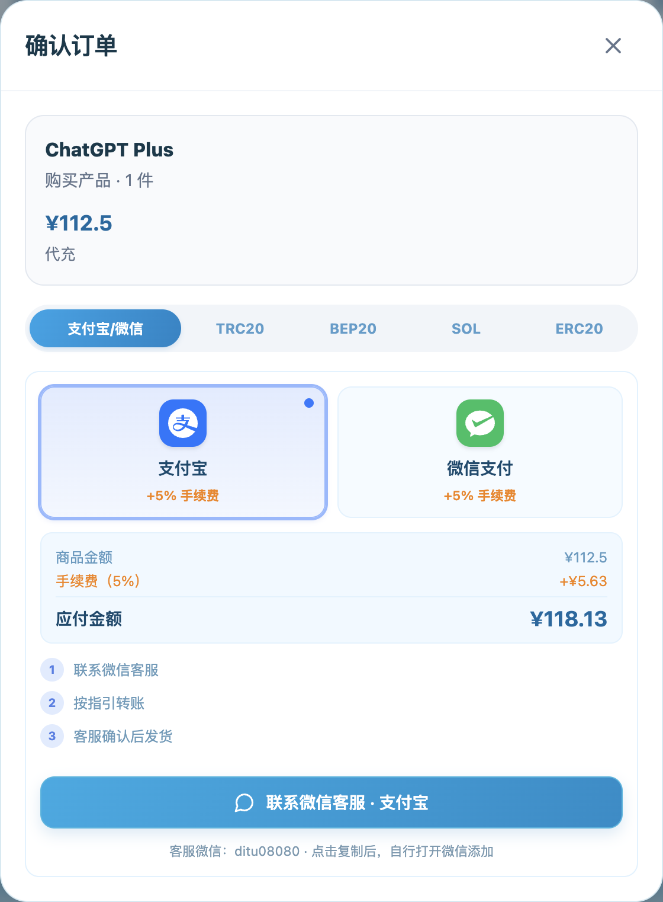

# ChatGPT Plus / Pro 购买与续费指南

购买 ChatGPT 会员，先确定两件事：**继续用自己的账号，还是购买另一个账号；当前套餐是否已经够用。** 然后再比较实际付款金额，避免只看标题里的低价。

本文由 ZAI123 维护，商品和付款流程核对于 **2026 年 10 月 4 日**。完整在售清单见 [仓库首页](../README.md)。

## Plus、Pro 5x / 20x 怎么选？

| 使用情况 | 选购时优先核对什么 |
| --- | --- |
| 已确定需要 Plus，给自己的账号开通 | 选择 Plus 原号代充，确认当前账号能否办理及订阅有效期 |
| 已有 Plus，考虑升级 Pro | 先查看实际使用是否频繁触及额度，再确认升级档位、费用和原订阅处理方式 |
| 使用 Codex 做较多开发任务 | 先核对现有账号的 Codex 用量，再比较更高档位；阅读 [Codex 指南](codex-recharge-guide.md) |
| 没有准备使用的账号 | 比较成品账号的交付内容、账号控制权和售后安排 |
| 比较“速刷”与常规 Pro | 对照有效期、交付形式和售后条件，不能只按商品名称判断权益相同 |
| 批量购买 Business | 当前 20 件起购，先核对总价及账号交付方式 |

“GPT Pro 5x”“GPT Pro 20x”是本店当前商品名称。官方套餐及额度规则可能调整，名称里的倍数不能直接作为固定消息数或任务数承诺。官方用量还与任务复杂度等因素有关，参见 [官方套餐与用量说明](https://learn.chatgpt.com/docs/pricing)。

## 商品价格与实际付款金额

以下以购买 1 件、选择支付宝或微信、手续费 5% 为例：

| 商品 | 商品金额 | 含手续费应付金额 |
| --- | ---: | ---: |
| ChatGPT Plus | ¥112.50 | **¥118.13** |
| GPT Pro 5x | ¥675.00 | **¥708.75** |
| GPT Pro 20x | ¥1,275.00 | **¥1,338.75** |
| GPT 5X 速刷 | ¥315.00 | **¥330.75** |
| GPT 20X 速刷 | ¥675.00 | **¥708.75** |

Business 按最低 20 件计算：¥121.50 × 20 = ¥2,430.00，加 5% 手续费后是 **¥2,551.50**。它不是 ¥121.50 即可完成的个人单件订单。

价格对比应使用**同一种交付形式、同样有效期、相同售后范围的实付金额**。商品标价、支付手续费以及交付条件都影响最终选择。

**[在 ZAI123 首页查看当前套餐与付款金额](https://zai123.com/?utm_source=github&utm_medium=referral&utm_campaign=chatgpt_recharge_guide&utm_content=plus_pro)**

## 原号代充与成品账号的选择

原号代充的目标是为你指定的账号办理会员；成品账号则交付另一个账号。想继续使用原有账号时，应明确选择代充，并在付款前确认客服将要办理的是哪个账号。

现有 Plus、Pro 5x / 20x 商品支持选择这两种形式；速刷和 Business 当前显示为成品账号。是否支持原号办理，以当时商品页面和客服答复为准。

续费或升级时，先查看自己的当前套餐和到期情况。已有自动续费安排的账号，应确认原订阅如何处理，避免在没有核对的情况下重复购买。

## 实际购买步骤

1. 首页选择 ChatGPT 商品，展开后选择交付形式和数量。
2. 点击“立即购买”，选择支付宝或微信，核对商品、数量、手续费和应付金额。
3. 添加页面上的客服微信，确认有效期、办理时间和售后范围，按指引付款。
4. 客服核实收款并交付后，登录对应账号查看套餐信息；如果主要用 Codex，再检查 Codex 登录的是否为同一账号。

图中为购买界面的操作示例，未实际付款。支付宝、微信订单通过客服办理，并非点击按钮后自动发放会员。

## 收到后怎么确认？

- 核对交付账号是否与约定一致，原号代充尤其要避免登录到另一个账号查看结果。
- 在账号内查看套餐与到期相关信息，而不只看客服发来的截图。
- 遇到问题时保留付款凭证及沟通记录，通过原购买客服核对处理。

本文记录公开商品和操作界面，不将截图示例当作购买成功或交付速度的证明。具体有效期和售后条件以订单确认内容为准。

[返回充值指南](../README.md) · [Codex 充值与使用指南](codex-recharge-guide.md)
